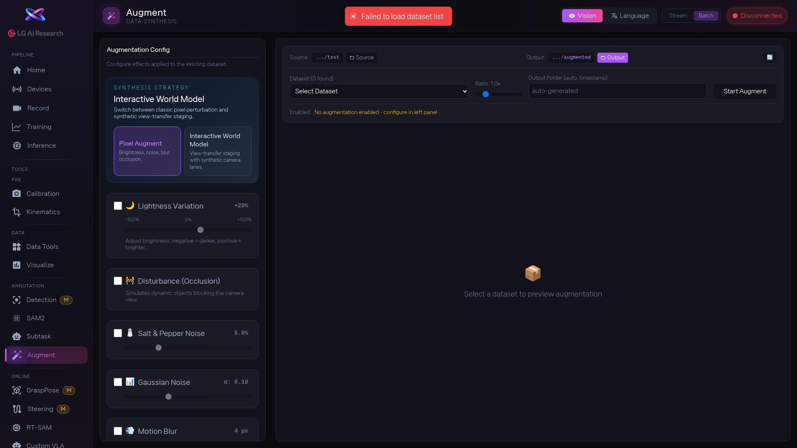

1. 상단에서 무엇을 늘릴지 고릅니다: [btn:Vision] 은 이미지 변형, [btn:Language] 는 지시문 변형입니다.

2. **Vision — Pixel Augment**: 원하는 변환을 토글로 켭니다. [btn:Lightness](밝기), [btn:Salt & Pepper](점 노이즈), [btn:Gaussian](가우시안 노이즈), [btn:Blur](흐림), [btn:Color Jitter](색조 변환), [btn:Disturbance](왜곡) 각각의 세기를 슬라이더로 조절합니다. [btn:Stream] 탭에서 미리보기로 결과가 자연스러운지 확인하세요.

3. **Vision — View Transfer** (선택): 합성 카메라 시점을 만들고 싶으면 View Transfer를 켜고 백엔드를 고릅니다 — [btn:Local Warp MVP], [btn:Interactive World Model], [btn:Custom Adapter]. Source Camera, Strength, Sway, Zoom 슬라이더와 Synthetic Camera Suffix를 설정합니다.

4. 설정이 끝나면 [btn:Batch] 탭으로 이동합니다. 데이터셋을 선택하고, 증강 비율(Augmentation Ratio)과 출력 폴더를 정한 뒤 [btn:Start Batch Augmentation] 을 눌러 실행합니다.

5. **Language 모드**: 데이터셋을 선택하고 [btn:Load Tasks] 로 기존 지시문을 불러옵니다. [btn:Manual Input] 으로 직접 새 표현을 추가하거나, [btn:LLM] 을 선택해 EXAONE 모델명과 원본 지시문을 입력하고 [btn:Compose Variants] 로 AI가 다양한 변형을 만들게 합니다. 생성된 지시문을 하나씩 검토한 뒤 [btn:Apply to Dataset] 으로 저장합니다.

6. 증강이 끝나면 Visualize나 Data Tools에서 결과를 다시 확인하세요. 변형 데이터가 원본과 너무 다르면 빼는 것이 나을 수도 있습니다.

<!-- 스크린샷을 추가하려면 아래처럼 작성하세요:

-->
