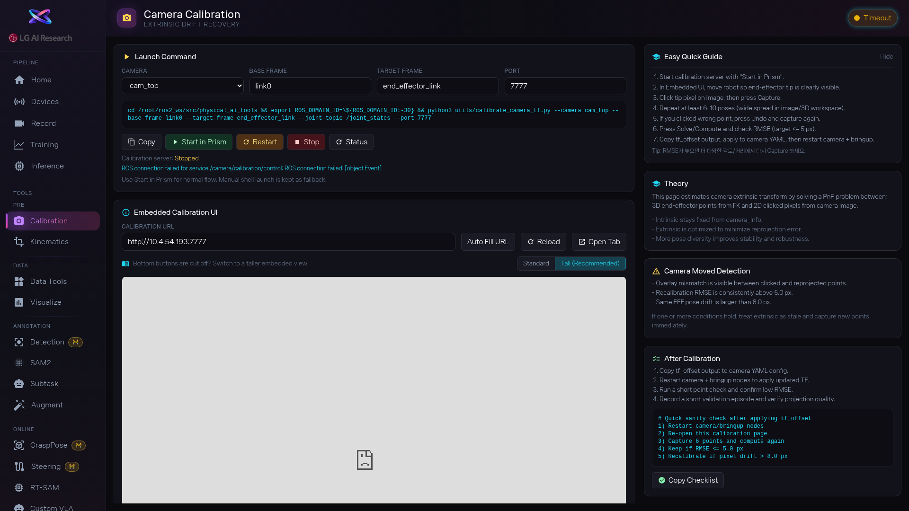

1. Camera 드롭다운에서 캘리브레이션할 카메라를 고르고, Base Frame과 Target Frame 이름을 확인합니다. 높이 프리셋은 [btn:Standard] 또는 [btn:Tall (Recommended)] 를 선택하세요.

2. [btn:Start in Prism] 을 눌러 캘리브레이션 서버를 시작합니다. 서버 상태가 초록색으로 바뀌면 정상입니다. 화면 아래에 캘리브레이션 UI가 나타납니다. 안 뜨면 [btn:Auto Fill URL] → [btn:Reload] 를 눌러보세요.

3. 로봇 자세를 다양하게 바꿔가며 6~10회 이상 점을 찍습니다. 팔을 쭉 뻗거나, 접거나, 옆으로 돌리는 등 최대한 다양한 자세로 찍어야 결과가 정확합니다.

4. 점을 다 찍으면 캘리브레이션 UI에서 [btn:Capture], [btn:Solve] 또는 [btn:Compute] 를 진행합니다.

5. 결과가 나오면 [btn:Copy] 또는 [btn:Copy Checklist] 로 보정값을 복사해서 YAML 설정에 반영하고, 카메라를 재시작합니다.

