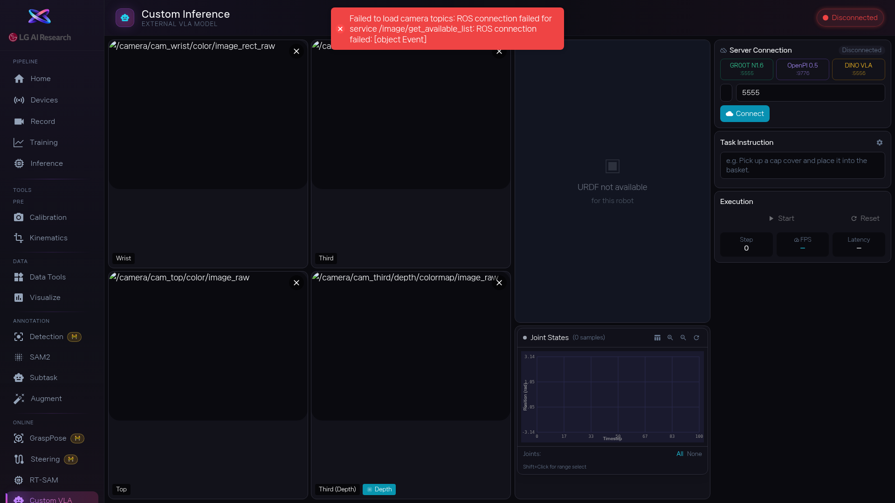

1. `config/` 폴더에 새 로봇용 YAML 파일을 만듭니다. 파일 이름이 곧 로봇 타입 이름이 됩니다. 안에는 카메라 topic, 관절 topic, 관절 순서, 초기 자세를 입력합니다. 기존 로봇 파일을 복사해서 수정하면 실수를 줄일 수 있어요.

2. 로봇 쪽에서 카메라 영상은 `CompressedImage`, 관절 상태는 `JointState`, 관절 명령은 `JointTrajectory` 형식으로 보내도록 ROS adapter를 준비합니다. 형식이 다르면 PRISM이 데이터를 인식하지 못합니다.

3. PRISM을 재시작하고 Home에서 새 로봇 카드가 보이는지 확인합니다. 카드가 보이면 선택 후 Devices 화면으로 이동해서 카메라 영상이 나오는지, 관절 상태가 맞는지, 3D 모델이 실제 로봇과 같은지 하나씩 점검하세요.

<!-- 스크린샷을 추가하려면 아래처럼 작성하세요:

-->
