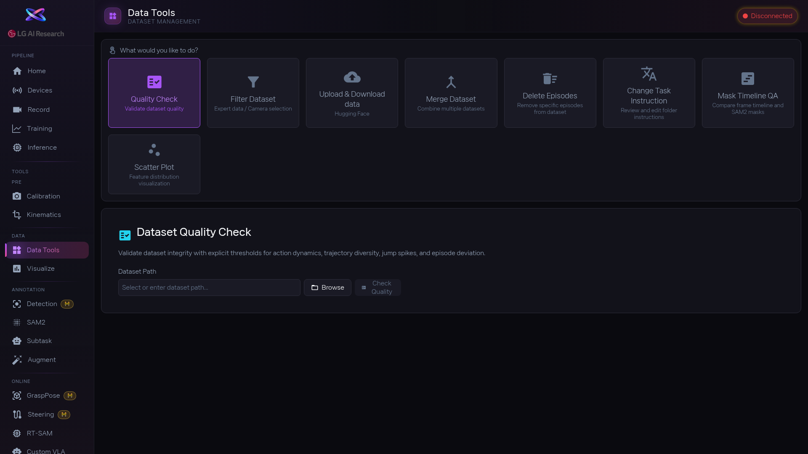

1. 데이터 상태부터 확인하고 싶으면 [btn:Quality Check] 타일을 먼저 누르세요. 데이터셋 경로를 지정하면 전체 품질 요약이 나옵니다. 어떤 에피소드에 문제가 있는지 한눈에 볼 수 있습니다.

2. 문제가 발견되면 상황에 맞는 도구를 씁니다: [btn:Delete Episodes] 로 실패한 에피소드를 삭제하거나, [btn:Filter Dataset] 로 조건에 맞는 에피소드만 골라내거나, [btn:Merge Dataset] 으로 여러 데이터셋을 하나로 합칩니다. 삭제 전에는 미리보기를 꼭 확인하세요.

3. 작업 지시문이나 마스크 품질도 점검해야 한다면: [btn:Change Task Instruction] 으로 지시문 수정, [btn:Mask Timeline QA] 로 마스크 품질 확인, [btn:Scatter Plot] 으로 데이터 분포를 확인합니다. [btn:Upload & Download data] 는 HuggingFace 등과 데이터를 주고받을 때 씁니다.

4. 모든 정리가 끝나면 Training 화면으로 넘어갑니다. 데이터가 깨끗할수록 학습 결과가 좋습니다.

<!-- 스크린샷을 추가하려면 아래처럼 작성하세요:

-->
