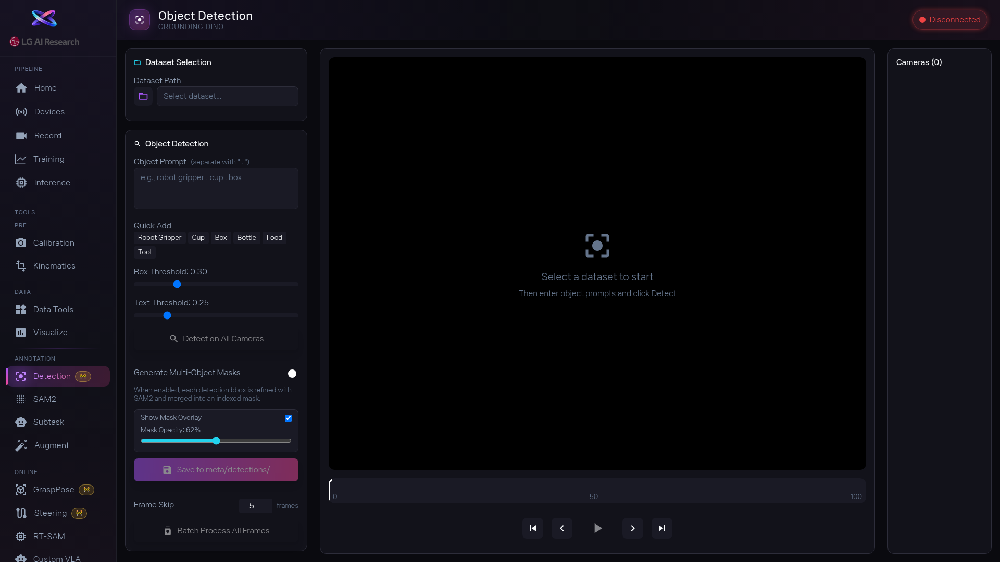

1. 데이터셋 경로를 지정하고, 확인하고 싶은 에피소드와 프레임을 선택합니다.

2. 찾을 물체 이름을 입력합니다. 자주 쓰는 물체는 [btn:Robot Gripper], [btn:Cup], [btn:Box], [btn:Bottle], [btn:Food], [btn:Tool] 프리셋 버튼을 누르면 자동 입력되어 편리합니다.

3. [btn:Detect on All Cameras] 를 눌러 한 프레임에서 먼저 결과를 확인합니다. 검출이 잘 안 되면 물체 이름을 다른 표현으로 바꿔보거나, 임계값 슬라이더를 조정해 보세요. 만족스러운 결과가 나올 때까지 이 단계를 반복합니다.

4. 한 프레임에서 결과가 좋으면, [btn:Save to meta/detections/] 로 저장하거나, [btn:Batch Process All Frames] 로 모든 프레임에 한번에 적용합니다.

