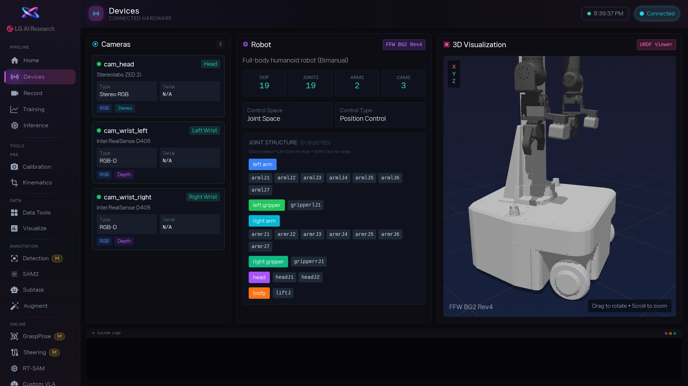

1. [area:카메라 목록] 을 봅니다. 카메라 개수와 이름이 실제 장비와 같나요? 예를 들어 Wrist(손목 카메라), Third(측면 카메라), Top(위 카메라)이 모두 보여야 합니다. 목록이 비어 있으면 [btn:Refresh] 를 눌러보세요. 카메라가 빠져 있으면 연결 상태를 먼저 확인하세요.

2. [area:관절 구조] 에서 관절 이름을 하나씩 클릭해 봅니다. [area:3D 뷰어] 에서 해당 부위가 노란색으로 강조되면 정상입니다. 이상한 부위가 강조되면 관절 매핑이 잘못된 것이니 설정을 확인해야 합니다.

3. 모든 것이 정상이면 다음 단계로 넘어갑니다. 문제가 있다면 여기서 멈추고 Home에서 로봇 타입을 다시 확인하거나, 관리자에게 설정 점검을 요청하세요.

<!-- 스크린샷을 추가하려면 아래처럼 작성하세요:

-->
