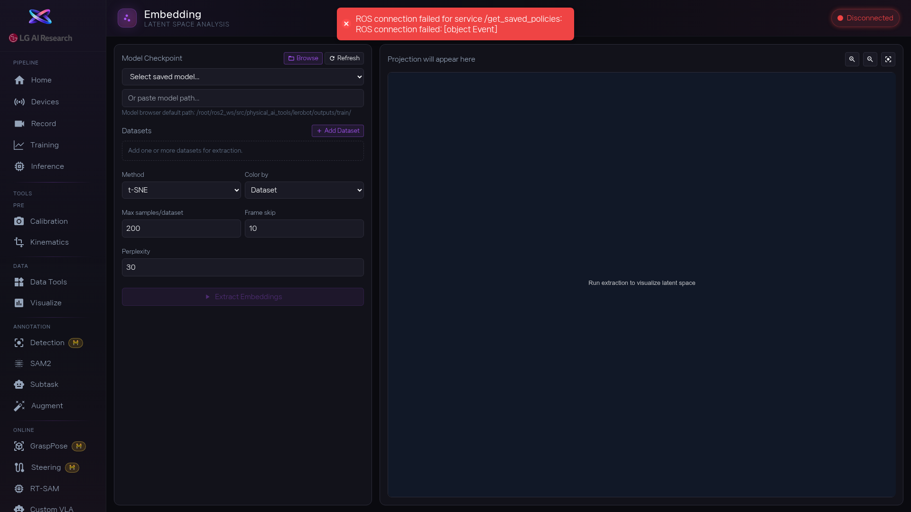

1. [btn:Browse] 로 분석할 모델 체크포인트를 선택합니다. 저장된 모델 드롭다운에서 바로 고르거나, 경로를 직접 입력할 수도 있습니다. 목록이 안 보이면 [btn:Refresh] 를 누르세요.

2. [btn:Add Dataset] 으로 비교하고 싶은 데이터셋을 1개 이상 추가합니다. 여러 데이터셋을 넣으면 어떤 데이터끼리 비슷한지 한눈에 볼 수 있습니다. 필요 없는 데이터셋은 [btn:Delete] 로 제거합니다.

3. 시각화 방법을 고릅니다 — Method 드롭다운에서 `t-SNE`, `PCA`, `UMAP` 중 택1. Color by 드롭다운에서 색상 기준을 `Dataset`, `Episode`, `Task` 중 선택합니다. Max samples와 Frame skip 값도 설정합니다. t-SNE를 고르면 Perplexity, UMAP을 고르면 n_neighbors 추가 옵션이 나타납니다.

4. [btn:Extract Embeddings] 를 누르면 추출이 시작됩니다. 진행률 바와 처리된 샘플 수가 표시됩니다. 완료되면 오른쪽에 산점도가 나타납니다.

5. 산점도에서 [btn:Zoom In], [btn:Zoom Out], [btn:Reset View] 로 세부 영역을 확인합니다. 점 위에 마우스를 올리면 해당 데이터의 상세 정보가 나옵니다.

<!-- 스크린샷을 추가하려면 아래처럼 작성하세요:

-->
