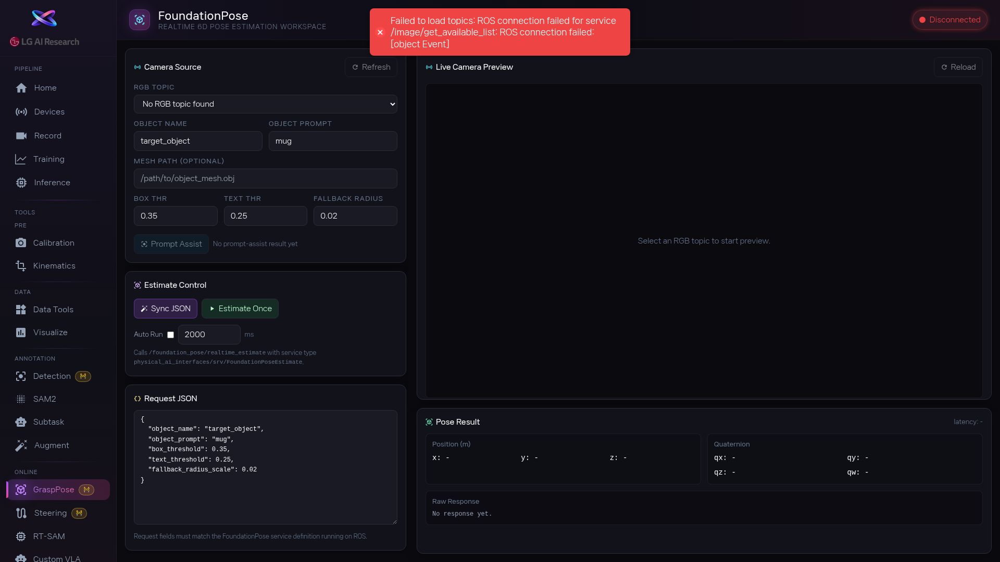

1. [btn:Refresh] 를 눌러 카메라 목록을 불러오고, 물체가 보이는 카메라를 RGB Topic 드롭다운에서 선택합니다.

2. Object Name과 Object Prompt를 입력합니다. 물체를 정확하게 잡기 어렵다면 [btn:Prompt Assist] 를 눌러 SAM2 + Grounding DINO 기반 자동 보조를 사용합니다. 3D Mesh 파일이 있으면 Mesh Path도 입력하세요. Box Threshold와 Text Threshold로 검출 민감도를 조정합니다.

3. [btn:Estimate Once] 를 눌러 포즈 추정을 실행합니다. 반복 추정이 필요하면 `Auto Run` 체크박스를 켜고 간격(ms)을 설정하세요.

4. [area:포즈 결과] 에서 Position(XYZ 위치), Quaternion(회전), Transform Matrix(4x4 변환 행렬)를 확인합니다. Raw Response에서 전체 JSON 응답도 볼 수 있고, Latency로 추정 속도를 확인합니다.

