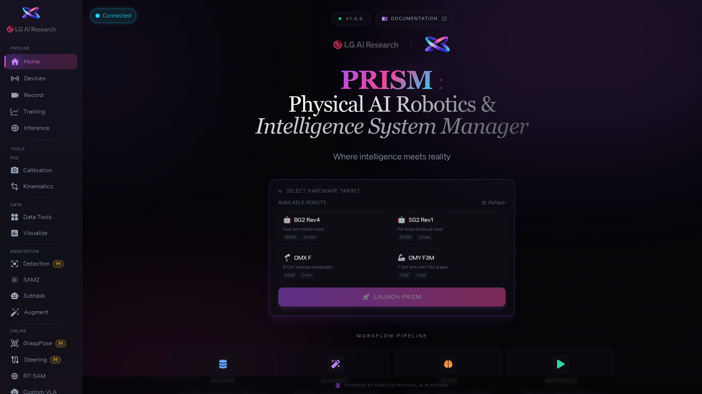

1. 화면에 로봇 카드가 보이지 않나요? [btn:Refresh] 를 눌러 목록을 새로고침하세요. 로봇이 켜져 있고 네트워크에 연결되어 있어야 카드가 나타납니다.

2. 내 로봇 카드를 클릭합니다. 선택되면 카드 테두리 색이 바뀌면서 강조되고, 연결 상태 표시가 초록색으로 바뀝니다. 카드에 적힌 로봇 이름과 실제 로봇이 일치하는지 꼭 확인하세요.

3. [btn:Launch PRISM] 을 누르면 Devices 화면으로 넘어갑니다. 만약 특정 작업으로 바로 가고 싶다면, 아래쪽 워크플로우 카드 [btn:Record], [btn:Augment], [btn:Train], [btn:Inference] 중 하나를 눌러도 됩니다.

