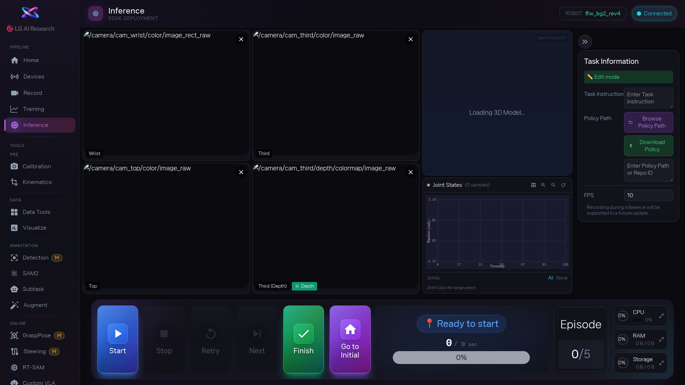

1. [area:Inference 패널] 에서 `Task Instruction`(작업 지시)을 입력하고, [btn:Browse Policy Path] 로 학습된 정책 폴더를 선택합니다. HuggingFace에서 내려받고 싶으면 [btn:Download Policy] 를 눌러 User ID와 Repository ID를 입력합니다.

2. [area:모델 로딩 상태] 를 지켜봅니다. `Idle` → `Validating` → `Loading Policy Class` → `Loading Model Weights` → `COMPLETED` 순서로 진행됩니다. 로딩 중에 오류가 나오면 정책 경로가 맞는지 확인하세요. **로딩이 끝나기 전에 Start를 누르면 동작하지 않습니다.**

3. 로딩 완료 후 [btn:Start] (또는 `Space` 키)를 누르면 로봇이 움직이기 시작합니다. [area:카메라 2x2 그리드] 에서 로봇 동작을 계속 지켜보세요.

4. 이상한 움직임이 보이면 즉시 [btn:Stop] (또는 `Space` 키)을 누르세요. 다른 컨트롤: [btn:Retry] (`←`) 다시 시도, [btn:Next] (`→`) 다음 에피소드, [btn:Go to Initial] (`Ctrl+Shift+H`) 초기 자세 복귀, [btn:Finish] (`Ctrl+Shift+X`) 전체 종료.

