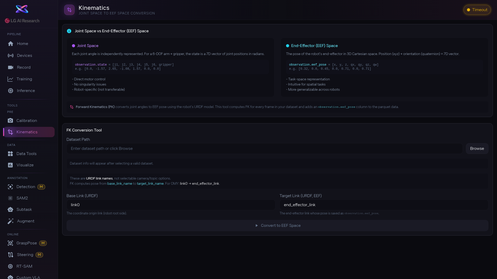

1. [btn:Browse] 를 눌러 변환할 데이터셋을 선택합니다. 선택하면 [area:데이터셋 정보] 에 에피소드 수, 프레임 수, FPS, feature 목록이 자동으로 표시됩니다.

2. `Base Link URDF`와 `Target Link URDF` 이름을 확인합니다. 보통은 기본값(link0, end_effector_link)이 맞지만, 다른 종류의 로봇이라면 URDF 파일에서 실제 link 이름을 찾아 입력해야 합니다.

3. [btn:Convert to EEF Space] 를 누르면 변환이 시작됩니다. 진행률 바가 표시되고, 데이터가 많으면 시간이 걸릴 수 있습니다.

4. 변환이 끝나면 [area:변환 결과] 에 컬럼 목록과 샘플 데이터가 표시됩니다. [btn:Open 3D EEF Trajectory in Visualize] 를 눌러 결과를 바로 3D로 확인하세요. 궤적이 자연스럽게 이어지면 성공, 끊기거나 튀는 곳이 있으면 프레임 이름이나 데이터를 다시 확인합니다.

<!-- 스크린샷을 추가하려면 아래처럼 작성하세요:

-->
