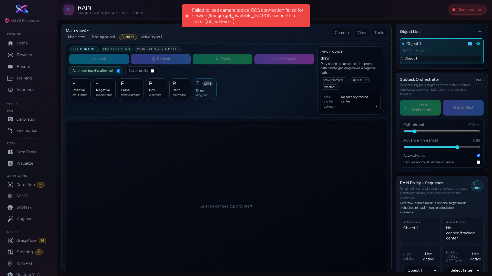

1. [btn:Load Topics] 로 카메라 목록을 불러오고, 추적할 카메라를 선택합니다. [btn:Warmup] 으로 추적 모델을 로드합니다.

2. 영상에서 추적할 물체를 프롬프트 모드([btn:Positive], [btn:Box] 등)로 지정하고, [btn:Cache] → [btn:Start] 로 추적이 안정적인지 먼저 확인합니다. 마스크가 물체를 잘 따라가면 다음으로 넘어갑니다.

3. 작업 단계를 정의합니다. [btn:Add Step] 으로 단계를 추가하고, Source Object(잡을 물체)와 Target Object(놓을 곳)를 선택합니다. 관계는 드롭다운에서 `On`(위에) 또는 `In`(안에)을 고릅니다.

4. RAIN 모델을 사용하려면: Progress/Action Checkpoint 경로를 입력하고 [btn:Load Model] → [btn:Run Inference] 로 추론합니다. [btn:Execute Step] 으로 개별 단계를 실행할 수도 있습니다.

5. 모든 단계를 정의했으면 [btn:Save Task Sequence] 로 결과를 저장합니다.

<!-- 스크린샷을 추가하려면 아래처럼 작성하세요:

-->
