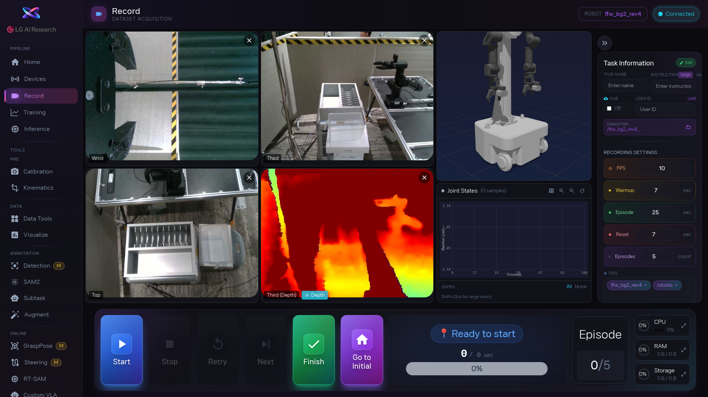

1. 먼저 [area:작업 정보 패널] 에서 녹화 설정을 입력합니다. Task Name(작업 이름)은 나중에 데이터를 찾을 때 쓰이니 알아보기 쉽게 적어주세요. Task Instruction(작업 설명), User ID, FPS도 입력하고, [area:카메라 2x2 그리드] 에서 카메라 영상이 정상으로 나오는지 확인합니다.

2. 준비가 되면 [btn:Start] 를 누릅니다. 화면 아래 상태 표시가 `WARMING_UP`(준비 중) → `RECORDING`(녹화 중) → `RESETTING`(초기화 중) 순서로 바뀝니다. 녹화 도중에 쓸 수 있는 버튼들: [btn:Stop] 은 현재 에피소드를 저장하고 중단, [btn:Retry] 는 지금 시연을 버리고 다시, [btn:Next] 는 바로 다음 에피소드로 넘어가기, [btn:Finish] 는 전체 녹화를 끝냅니다.

3. 에피소드 하나가 끝나면 성공/실패 팝업이 뜹니다. 시연이 잘 됐으면 [btn:SUCCESS], 실패했으면 [btn:FAIL] 을 누르고 실패 이유를 적습니다. 이 기록이 나중에 데이터 정리와 학습 품질에 직접 영향을 주니, 솔직하게 기록하세요.

4. 녹화를 모두 마치면 "다음에 뭘 할까요?" 안내 모달이 뜹니다. [btn:Data Tools · Quality Check] 로 데이터 품질 확인, [btn:Visualize] 로 궤적 확인, [btn:Kinematics] 로 좌표 변환, [btn:SAM2] 로 마스크 생성 중 필요한 것을 선택하세요.

<!-- 스크린샷을 추가하려면 아래처럼 작성하세요:

-->
