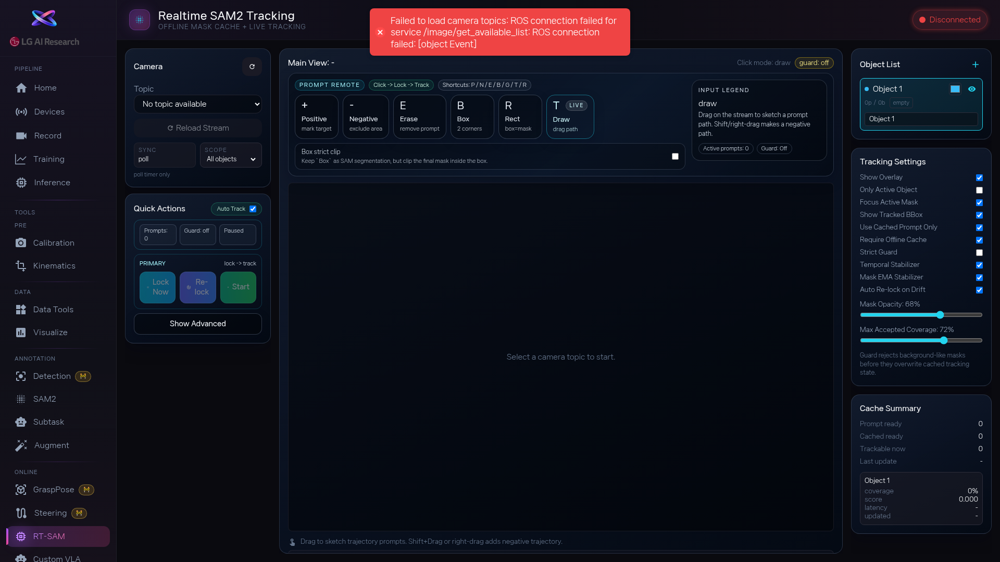

1. [btn:Load Topics] 를 눌러 사용 가능한 카메라 목록을 불러오고, 추적할 영상이 나오는 카메라를 선택합니다.

2. [btn:Warmup] 으로 SAM2 모델을 먼저 로드합니다. 그 다음 프롬프트 모드를 고릅니다: [btn:Positive] (`+`)로 물체 클릭, [btn:Box] (`B`)로 박스 지정, [btn:Rect] 는 박스 전체를 마스크로, [btn:Draw] 는 드래그 경로를 따라 마스크를 그립니다. [btn:Negative] (`-`)로 제외할 영역, [btn:Erase] (`.`)로 잘못 찍은 점을 지웁니다.

3. [btn:Cache] 로 현재 마스크를 캐시한 뒤, [btn:Start] 를 누르면 실시간 추적이 시작됩니다. 마스크가 물체를 계속 잘 따라가는지 지켜봅니다. 잠깐만 테스트하려면 [btn:Track Once] 로 한 프레임만 추적할 수도 있어요.

4. 추적 중에 마스크가 흔들리면 [btn:Stop] 으로 멈추고 물체를 다시 클릭해서 잠금을 갱신합니다. Poll Interval과 Mask Opacity 슬라이더로 추적 속도와 표시를 조정할 수 있습니다.

<!-- 스크린샷을 추가하려면 아래처럼 작성하세요:

-->
