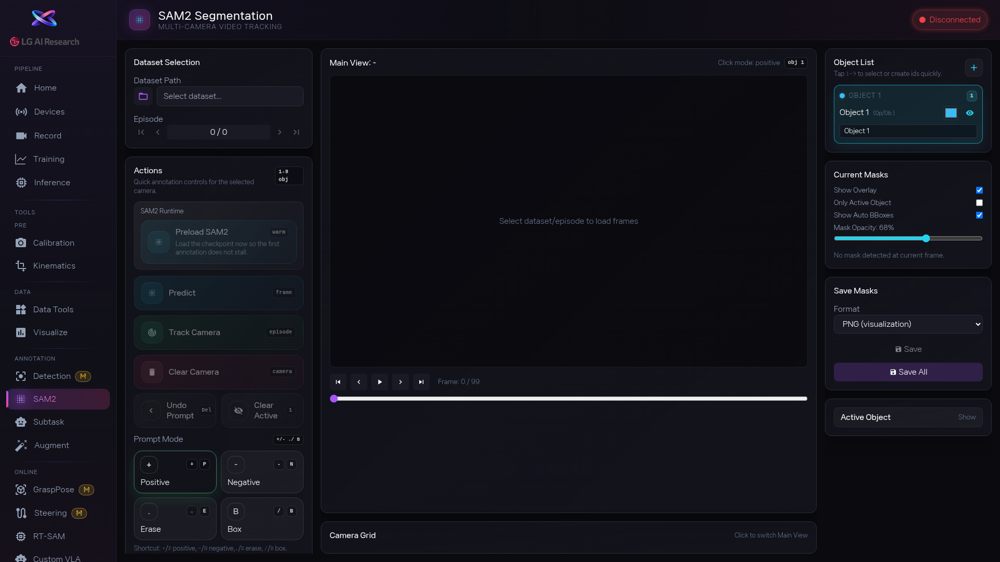

1. 데이터셋, 에피소드, 카메라를 선택합니다. SAM2 모델이 아직 안 올라와 있으면 [btn:Warmup SAM2] 를 먼저 누르세요. 모델 로딩에 잠깐 시간이 걸립니다.

2. [btn:Add object] 를 눌러 마스크를 만들 물체를 추가합니다. 프롬프트 모드를 고릅니다: [btn:Positive] (`+` 키)는 '이 점이 물체야', [btn:Negative] (`-` 키)는 '여기는 물체가 아니야', [btn:Box] (`B` 키)는 물체를 박스로 감쌉니다. [btn:Erase] (`.` 키)는 잘못 찍은 점을 지웁니다.

3. 현재 프레임의 마스크를 확인합니다. 빠진 부분이 있으면 [btn:Positive] 점을 추가하고, 넘친 부분이 있으면 [btn:Negative] 점을 찍으세요. Mask Opacity 슬라이더로 마스크 투명도를 조정할 수 있습니다.

4. 첫 프레임 마스크가 만족스러우면 [btn:Track Camera] 를 누릅니다. 전체 프레임에 마스크가 자동으로 퍼집니다. Play 버튼이나 프레임 이동 버튼으로 여러 프레임을 넘겨보면서 마스크가 계속 유지되는지 확인하세요.

5. 결과가 좋으면 [btn:Save] (현재 카메라만) 또는 [btn:Save All] (모든 카메라)로 저장합니다.

