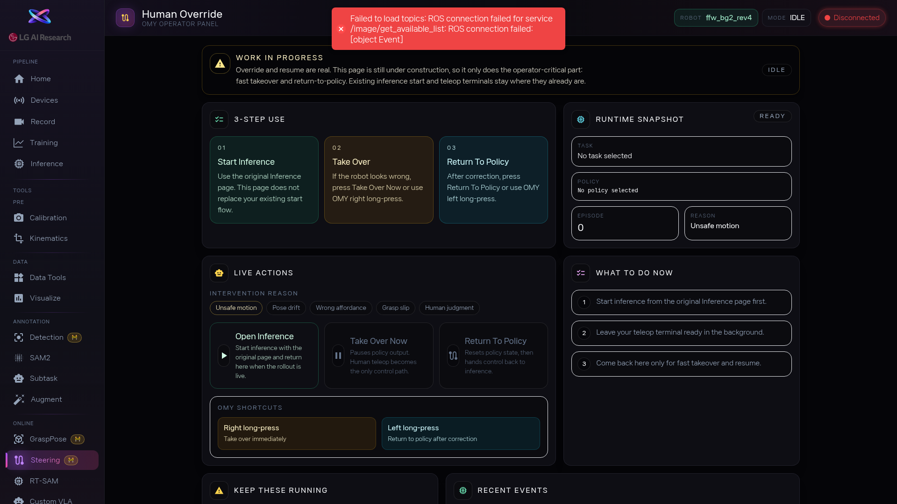

1. 이 화면은 Inference에서 정책이 실행 중일 때만 의미가 있습니다. 아직 Inference를 시작하지 않았다면 [btn:Open Inference] 를 눌러 먼저 정책을 실행하세요.

2. 로봇 동작에 문제가 보이면, 먼저 왜 개입하는지 이유를 선택합니다: [btn:Unsafe motion](위험한 움직임), [btn:Pose drift](자세 틀어짐), [btn:Wrong affordance](잘못된 접근), [btn:Grasp slip](물체 놓침), [btn:Human judgment](직감적 판단) 중 하나를 고르세요. 이 기록은 나중에 문제 분석에 쓰입니다.

3. [btn:Take Over Now] 를 누릅니다. 상태 뱃지가 `HUMAN OVERRIDE` 로 바뀌면서 사람 제어 모드가 됩니다. 이제 리더 로봇을 잡고 직접 교정 동작을 수행하세요.

4. 교정이 끝나면 [btn:Return To Policy] 로 다시 AI 자율 실행에 넘겨주거나, 상황이 안 좋으면 그대로 사람이 계속 제어해도 됩니다. 런타임 정보에서 현재 Task, Episode, 최근 이벤트를 확인할 수 있습니다.

