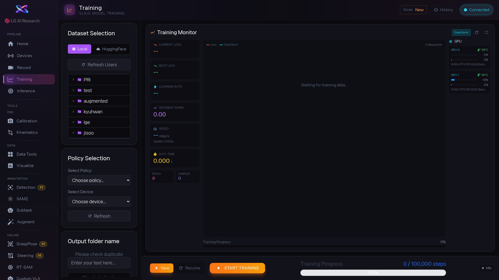

1. [area:왼쪽 설정 패널] 에서 학습할 데이터를 선택합니다. [btn:Local] 탭은 로컬에 저장된 데이터, [btn:HuggingFace] 탭은 온라인 데이터입니다. 목록이 비어 있으면 [btn:Refresh Users] 를 누른 뒤, 원하는 데이터셋 행을 클릭합니다.

2. 정책 종류(act, diffusion, pi0, pi05 등)와 device(GPU)를 고릅니다. `Output folder name` 에 나중에 알아볼 수 있는 이름을 입력하고, [btn:Check duplicate] 로 같은 이름이 이미 있는지 확인합니다. 이름이 겹치면 이전 결과를 덮어쓸 수 있어요.

3. [btn:Start Training] 을 누르면 학습이 시작됩니다. [area:메인 모니터링] 에서 loss 그래프가 점점 내려가는지 확인하고, [area:GPU 상태] 에서 메모리가 가득 차지 않았는지 함께 봅니다. loss가 안 내려가면 데이터나 설정에 문제가 있을 수 있습니다.

4. 이전에 중단했던 학습을 이어서 하고 싶다면: 상단에서 [btn:Resume] 모드로 전환하고, [btn:Browse] 또는 [btn:Edit] 로 기존 출력 폴더를 선택한 뒤 [btn:Load] → [btn:Resume Training] 순서로 진행합니다.

