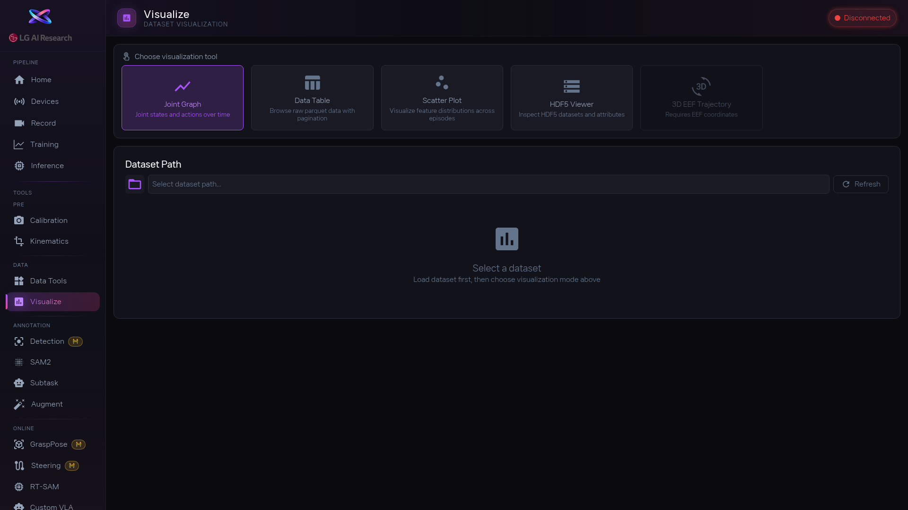

1. 데이터셋 경로를 입력하거나 [btn:Browse] 로 선택합니다. 에피소드 드롭다운에서 확인할 에피소드를 고릅니다.

2. 상단에서 보고 싶은 모드를 고릅니다:
   - [btn:Joint Graph]: 관절값이 시간에 따라 어떻게 변하는지 그래프로 보여줍니다. 특정 관절만 보고 싶으면 관절 버튼을 클릭해서 선택/해제합니다.
   - [btn:Data Table]: 원본 수치를 표로 보여줍니다. 페이지네이션으로 많은 데이터를 넘겨볼 수 있습니다.
   - [btn:Scatter Plot]: X축/Y축 Feature를 드롭다운에서 골라 데이터 분포를 산점도로 봅니다.
   - [btn:HDF5 Viewer]: 데이터 파일 내부 구조(datasets, attributes)를 확인합니다.
   - [btn:3D EEF Trajectory]: 로봇 팔끝이 그린 궤적을 3D로 보여줍니다 (Kinematics에서 EEF 변환 필요).

3. 이상한 값이 보이면 에피소드 번호와 프레임 번호를 기억해 두세요. 그 다음 Data Tools에서 해당 에피소드를 삭제하거나, Kinematics에서 좌표를 재확인하거나, Subtask에서 구간을 나눌 수 있습니다.

